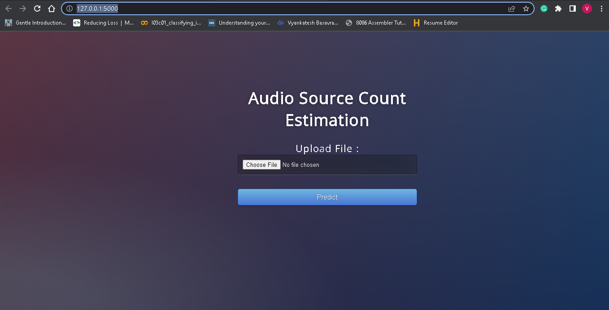

# Audio Source Count Estimation Using Deep Learning model 

***
## This application mainly deals with audio files in .wav format of any length. 
## Deep Learning model will predict number active sources in 1s consecutive audio segments.




### Build Image

```
docker build -t count . 
```

### Start Container with volume

```
docker run -it -p 5000:5000 -v ${PWD}:/app count 
```
### Website accessed

```
 localhost:5000
```
***